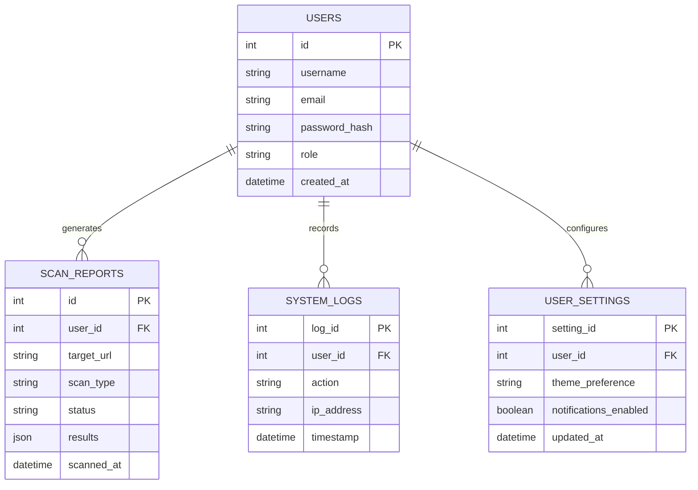

# Kryptic Vision Hub - Educational Cyber Security Toolkit & SaaS Analytics Platform

> **University 7th Semester Final Demonstration Project**  
> *Production-Grade, Modular Flask Web Application with Chart.js Analytics & ReportLab PDF Generation*

---

## 🛡️ Project Overview

**Kryptic Vision Hub** is a modular cyber security platform designed for educational analysis, vulnerability static code inspection, and wireless security simulation. The platform provides transparent, rule-based threat evaluation without relying on black-box Machine Learning models or paid third-party APIs.

---

## 🚀 Key Modules & Features

1. **Phishing URL Threat Scanner** (`scanner/phishing_detector.py`):
   - Rule-based analysis inspecting HTTP/HTTPS schemes, `@` characters, IP hostnames, TLD threat scoring, SSL validity, and redirect counts.

2. **SQL Injection Vulnerability Analyzer** (`scanner/sql_analyzer.py`):
   - Static code analyzer for Python, PHP, Node.js, and Java inspecting SQL query concatenation and unparameterized query calls.

3. **Cross-Site Scripting (XSS) Vulnerability Analyzer** (`scanner/xss_analyzer.py`):
   - Static code analyzer inspecting HTML/JS DOM assignments (`innerHTML`, `document.write`, `dangerouslySetInnerHTML`, `| safe` filter).

4. **Fake WiFi Security Analyzer** (`scanner/wifi_detector.py`):
   - Rule-based simulation evaluating access point encryption (WEP/Open), signal strength, channel, and frequency.

5. **Evil Twin Detection Simulator** (`scanner/evil_twin_detector.py`):
   - Rule-based simulation evaluating SSID vs BSSID (MAC Address) mismatches and encryption profile shifts.

6. **Interactive Analytics Dashboard with Chart.js**:
   - 8 Real-Time Metric Cards (Total Users, Total Scans, Safe, Dangerous, SQL, XSS, WiFi, Evil Twin).
   - 4 Dynamic Charts: Threat Distribution Pie Chart, Module Usage Bar Chart, Daily Scans Line Chart, and Safety Ratio Doughnut Chart.

7. **Server-Side PDF Report Engine (ReportLab)**:
   - Exports formatted PDF security reports saved in `reports/pdf/`.

8. **Admin Control Panel** (`routes/admin.py`):
   - Restricted to `admin@kryptic.com`. Manage user accounts, view system analytics, and purge scan/contact records.

9. **User Profile & System Settings** (`routes/profile.py`, `routes/settings.py`):
   - Profile avatar selection, password updates, theme mode preferences (Light/Dark), and in-app toast preferences.

10. **System Audit Trail** (`routes/logs.py`):
    - Searchable system logs recording login events, scans, PDF exports, and profile changes.

11. **Help Center & Project Documentation** (`help.html`, `about_project.html`):
    - FAQs, OWASP defensive guidelines, project architecture overview, and academic guide credentials.

---

## 🔑 Demo Administrator Credentials

- **Email**: `admin@kryptic.com`
- **Password**: `admin123`

---

## 🚀 Installation & Running

### 1. Install Requirements
```bash
pip install -r requirements.txt
```

### 2. Launch Application
```bash
python app.py
```
Open `http://localhost:5000` in your web browser.

---

## 📁 File Structure Overview

```
KrypticVisionHub/
│
├── app.py                      # Application entry point & blueprint registration
├── config.py                   # App configuration & secret keys
├── requirements.txt            # Dependencies (Flask, Werkzeug, requests, reportlab)
├── README.md                   # Complete documentation
│
├── database/
│   ├── database.db             # Auto-initialized SQLite database
│   └── db.py                   # SQLite schemas & parameterized queries
│
├── scanner/
│   ├── phishing_detector.py    # Phishing URL heuristic scoring engine
│   ├── sql_analyzer.py         # Static code analysis engine for SQL Injection
│   ├── xss_analyzer.py         # Static code analysis engine for XSS
│   ├── wifi_detector.py        # Wireless configuration risk analyzer
│   └── evil_twin_detector.py   # Evil Twin simulation engine
│
├── routes/
│   ├── auth.py                 # Authentication routes (Login, Register, Logout)
│   ├── dashboard.py            # Analytics dashboard & Chart.js API
│   ├── scanner.py              # Phishing scanner & history routes
│   ├── sql_routes.py           # SQL Analyzer routes
│   ├── xss_routes.py           # XSS Analyzer routes
│   ├── wifi_routes.py          # WiFi Security routes
│   ├── evil_twin_routes.py     # Evil Twin Simulator routes
│   ├── profile.py              # User profile & password update routes
│   ├── settings.py             # Interface settings & preference routes
│   ├── admin.py                # Admin control panel routes
│   ├── logs.py                 # System audit log routes
│   ├── reports.py              # ReportLab PDF report generation routes
│   └── contact.py              # Contact form routes
│
├── templates/
│   ├── base.html               # Main layout (Inter font, Navbar, Toasts)
│   ├── index.html              # Home page
│   ├── login.html              # Login page with demo credentials
│   ├── register.html           # User registration page
│   ├── dashboard.html          # Analytics dashboard & 4 Chart.js charts
│   ├── scanner.html            # Phishing URL scanner
│   ├── sql_analyzer.html       # SQL static code analyzer
│   ├── xss_analyzer.html       # XSS static code analyzer
│   ├── wifi_analyzer.html      # WiFi security analyzer
│   ├── evil_twin.html          # Evil Twin simulator
│   ├── analysis_result.html    # Unified analysis results view
│   ├── history.html            # Advanced filterable history table
│   ├── profile.html            # User profile view
│   ├── settings.html           # Settings view
│   ├── admin.html              # Admin control panel view
│   ├── logs.html               # Audit logs view
│   ├── help.html               # Help center & FAQs
│   ├── about_project.html      # Academic project presentation
│   ├── contact.html            # Contact form view
│   └── 404.html                # Error page
│
├── static/
│   ├── css/
│   │   ├── style.css           # Core styling system & CSS variables
│   │   ├── dashboard.css       # Metric grid styling
│   │   ├── auth.css            # Auth card styling
│   │   ├── analysis.css        # Static code analysis page styling
│   │   ├── wifi.css            # Wireless simulation styling
│   │   ├── profile.css         # Profile page styling
│   │   ├── settings.css        # Settings page styling
│   │   ├── admin.css           # Admin panel styling
│   │   └── charts.css          # Chart.js canvas styling
│   └── js/
│       ├── app.js              # Core toast & scroll-to-top script
│       ├── scanner.js          # Phishing scanner form script
│       ├── dashboard.js        # Quick action script
│       ├── charts.js           # Chart.js initialization script
│       ├── sql.js              # SQL analyzer sample loader
│       ├── xss.js              # XSS analyzer sample loader
│       ├── wifi.js             # WiFi analyzer form script
│       ├── evil_twin.js        # Evil Twin simulator script
│       ├── profile.js          # Profile script
│       ├── settings.js         # Settings script
│       └── admin.js            # Admin panel script
│
└── reports/                    # Exported JSON and PDF reports
    └── pdf/                    # Generated ReportLab PDF files
```


